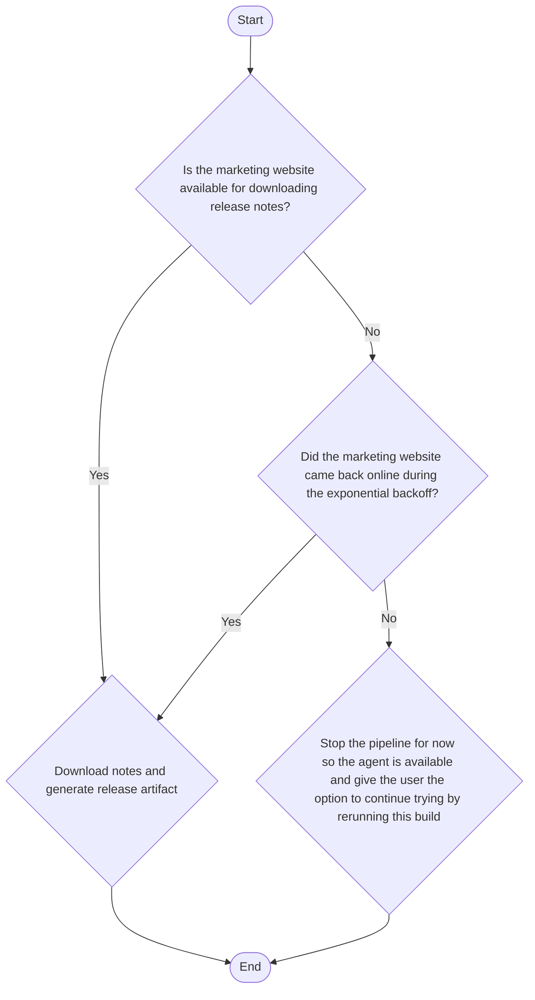

# Jetbrains test Assignment

## Before starting
To run this repository you need docker and docker-compose installed.

Since teamcity requires credentials to interact with the vcs. You will also have to fork this repository and make a token for teamcity.

## Repo structure

This repository has 3 main parts, a kotlin application, a docker compose and teamcity pipelines

### Kotlin Application

This is a very small kotlin application which relies on jetbrains [Dokka](https://github.com/Kotlin/dokka) to generate a javadoc that describes it. 

### Docker compose

Three containers are defined here. 
1. An nginx container which will server as a server for the marketing page giving release notes. It has three endpoints.
    1. /release-notes.txt which returns some release notes
   2. /release-notes-v2.txt which simulates an update by changing the release notes. Of course the original one could also be changed and redeployed, but I found this easier for the simulation
   3. /release-notes-fail which will just retun 500 to simulate when the marketing page is down
2. The teamcity agent which will be running the builds
3. The teamcity server with volumes pointing to local folders. 

## Teamcity pipelines

The objective of the pipelines is to produce a release artifact including the release notes and the javadoc. On a two-step procedure, with one build generating the javadoc and the other downloading the release notes and making the artifact.  This release artifact can be seen in the artifact rules
release-artifact.tar.gz

Starting from the inputs, the only required is a commit hash of the repository. This commit will be used for several steps on the line.

The first build starts by checking out on the provided commit while failing automatically if there is no commit that matches it.

It then continues by running mvn dokka:Javadoc, which will create a dokkaJavadoc folder on the target folder with all the files required for showing it.

The second build downloads the release notes and makes the release artifact with the javadoc available, in detail:



## Quick Start

This will set up the agent, teamcity server and marketing server.

```shell
  docker-compose up
```

Go to localhost:8111 and wait a bit until the server is ready.

If prompted for choosing a database, choose the default one.
Set up a user and password.

Create a new project and set up vcs settings with your forked repo and token. 

Agent always starts unauthorized, so go to the agents window and authorize the only one there is for the default pool.

There is a single build, take a commit from your repo and run it with the commit as input. You can choose the urls on the parameters. The first two work to simulate change, the third one doesnt work to simulate the marketing page being down.

If trying with the third one, you can rerun the second build with a correct url to simulate the marketing website being back online. 

## Reproducibility

To ensure reproducibility, for the packaged application, the recommendations for JVM on the reproduciblebuilds.org [page](https://maven.apache.org/guides/mini/guide-reproducible-builds.html) were followed; [Dokka](https://github.com/Kotlin/dokka), developed by Jetbrains, was used as a plugin for generating javadoc and [gnutar](https://www.gnu.org/software/tar/manual/html_section/Reproducibility.html) with the flags mentioned in their page was used for compression. 

