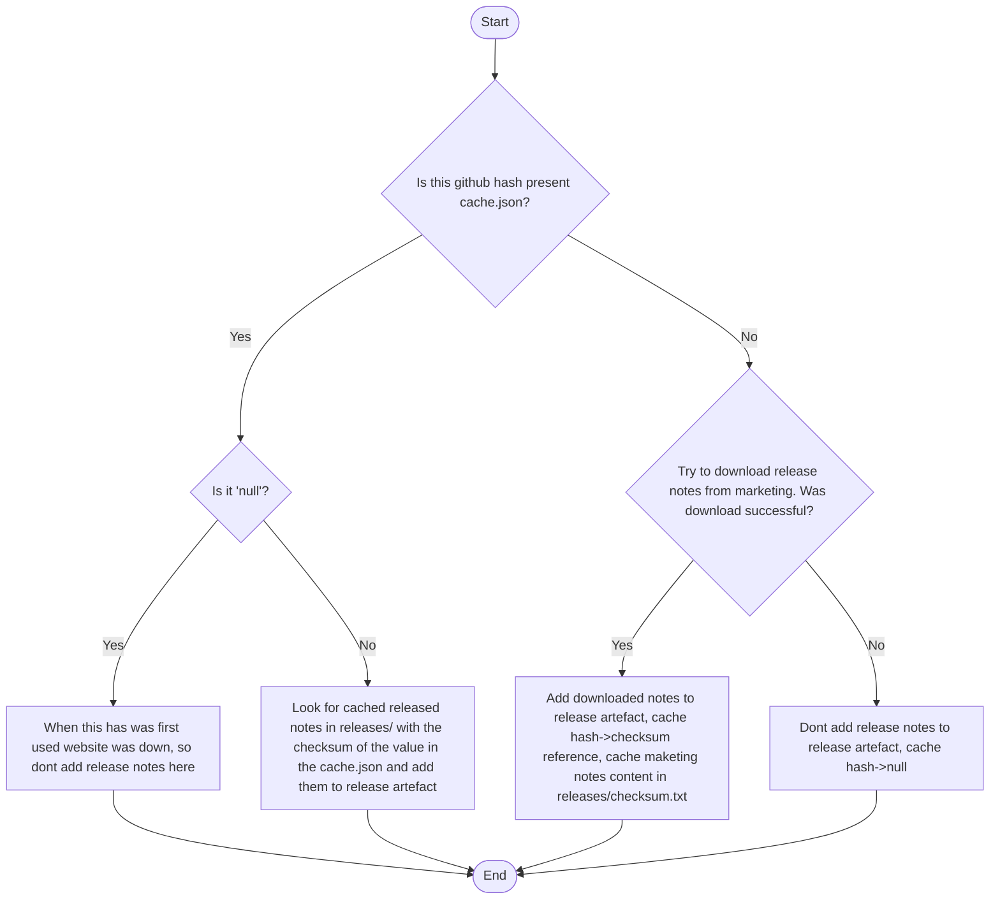

# Jetbrains test Assignment

## Before starting
To run this repository you need docker and docker-compose installed.

Since teamcity requires credentials to interact with the vcs. You will also have to fork this repository and make a token for teamcity.

## Repo structure

This repository has 3 main parts, a kotlin application, a docker compose and teamcity pipelines

### Kotlin Application

This is a very small kotlin application which relies on jetbrains [Dokka](https://github.com/Kotlin/dokka) to generate a javadoc that describes it. 

### Docker compose

Three containers are defined here. 
1. An nginx container which will server as a server for the marketing page giving release notes. It has three endpoints.
    1. /release-notes.txt which returns some release notes
   2. /release-notes-v2.txt which simulates an update by changing the release notes. Of course the original one could also be changed and redeployed, but I found this easier for the simulation
   3. /release-notes-fail which will just retun 500 to simulate when the marketing page is down
2. The teamcity agent which will be running the builds
3. The teamcity server with volumes pointing to local folders. 

## Teamcity pipeline

The objective of the pipeline is to produce a release artifact including the release notes and the javadoc. This release artifact can be seen in the artifact rules along with two more artifacts which will be used later.
cache/
releases/
release-artifact.tar.gz

Starting from the inputs, the only required is a commit hash of the repository. This commit will be used for several steps on the line.

The pipeline starts by checking out on the provided commit while failing automatically if there is no commit that matches it.

It then continues by running mvn dokka:Javadoc, which will create a dokkaJavadoc folder on the target folder with all the files required for showing it.

The third step downloads the release notes and makes the release artifact with the javadoc available, in detail:
1. It starts by downloading jq and adding it to the path. Of course a new image with the agent and jq could have been made, but I thought that making an extra step for the setup was not worth it. 
2. It will decide how to handle the artifact based on the following logic:


The json cache will look like this. Its objective is to save the least amount of release notes in the cache by tracking which commits use repeated ones.
```json
{
"e57fec4385daa6bebc5bb5b38862eb114ae55bc8": "92a4ad08c9040b2a9b12cc9f3d2adf82a0ab8c7ec7e3215db9b4b5d47c110e75",
"aae38e68d2a1a67a972f08036dd61ebe6b477b9c": "92a4ad08c9040b2a9b12cc9f3d2adf82a0ab8c7ec7e3215db9b4b5d47c110e75",
"774c256767a0b59d678b3278191d085d249972ce": "test",
"e82cf67bbd4d707643a709c27a2ff0610292a097": null
}
```

The releases/ folder will look like this 

92a4ad08c9040b2a9b12cc9f3d2adf82a0ab8c7ec7e3215db9b4b5d47c110e75.txt

test.txt


## Quick Start

This will set up the agent, teamcity server and marketing server.

```shell
  docker-compose up
```

Go to localhost:8111 and wait a bit until the server is ready.

Set up a user and password.

Set up vcs settings with your forked repo and token. 

There is a single project with a single build, take a commit from your repo and run it with the commit as input.

If you want to simulate the marketing page updating or being down, you can change the url on the properties or change the nginx config and redeploy it.

